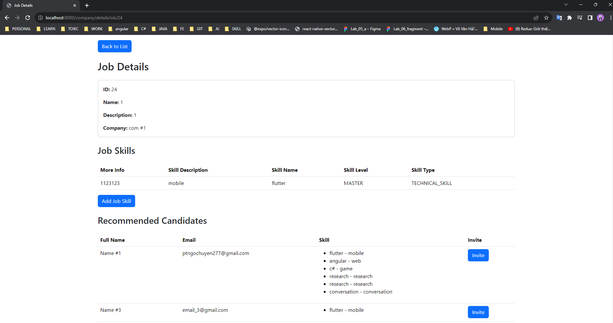

# Tuyển Dụng và Gợi Ý Kỹ Năng

## Mô tả Dự Án
Dự án này nhằm xây dựng một hệ thống tuyển dụng trực tuyến kết nối giữa các công ty và ứng viên. Hệ thống cung cấp các chức năng quản lý công việc, kỹ năng, và ứng viên để tối ưu hóa quá trình tìm kiếm và tuyển dụng. Dưới đây là mô tả chi tiết về các chức năng và thành phần chính của dự án.

Tính Năng Chính
1. Quản lý Ứng Viên
   Thêm Ứng Viên: Cung cấp giao diện cho công ty để thêm thông tin về ứng viên vào hệ thống. Các chi tiết bao gồm tên, kinh nghiệm làm việc, và kỹ năng.
2. Quản lý Công Việc
   Thêm Công Việc: Cho phép công ty đăng tin tuyển dụng bằng cách cung cấp các thông tin như vị trí, mô tả công việc, và kỹ năng yêu cầu.
3. Quản lý Kỹ Năng
   Thêm Kỹ Năng: Hỗ trợ thêm mới kỹ năng vào hệ thống, giúp mô tả chính xác về yêu cầu công việc và kỹ năng của ứng viên.
4. Gợi Ý Công Việc
   Gợi Ý Công Việc cho Ứng Viên: Khi ứng viên đăng nhập, hệ thống sẽ gợi ý các công việc phù hợp với kỹ năng và kinh nghiệm của họ.
5. Tìm Kiếm Ứng Viên
   Tìm Kiếm Ứng Viên theo Kỹ Năng: Cung cấp công cụ tìm kiếm để công ty có thể dễ dàng tìm ứng viên phù hợp với yêu cầu của công việc.
6. Gửi Email Mời
   Gửi Email Mời Ứng Viên: Hỗ trợ công ty gửi email mời ứng viên phù hợp sau khi tìm kiếm và chọn lựa.
### Mô hình Ứng Dụng

Ứng dụng sử dụng spring boot

* Phần backend chứa các lớp để xử lý 
* Phần controller chứa các cotroller để điều khển 
* Phần templates chứa các View 

## Cài Đặt và Triển Khai

## Cài đặt

Để chạy web, bạn cần có môi trường sau:

- MariaDB
- Một máy chủ web (ví dụ: Apac Tomcat).
- Môi trường java JDK 17

### Cài đặt MariaDB

1. Tải và cài đặt MariaDB hoặc MySQL từ [https://mariadb.org/download/](https://mariadb.org/download/).

2. Đăng nhập vào MariaDBbằng tài khoản root và tạo một tài khoản với tên "sa" và mật khẩu "sapsword". Sử dụng các lệnh
   SQL sau:
   CREATE USER 'sa'@'localhost' IDENTIFIED BY 'sapsword';
   GRANT ALL PRIVILEGES ON . TO 'sa'@'localhost' WITH GRANT OPTION;
   FLUSH PRIVILEGES.

### Cài đặt Apache Tomcat

1. Đảm bảo bạn đã cài đặt máy chủ ứng dụng servlet như Apache Tomcat trên máy chủ web của bạn.Có thể tại ở
   đây (https://tomcat.apache.org/download-10.cgi)

2. Triển khai mã nguồn của ứng dụng lên máy chủ ứng dụng servlet. Đảm bảo tệp WAR của ứng dụng được đặt trong thư mục
   webapps của Apache Tomcat..Xem hướng
   đẫn (https://www.jetbrains.com/idea/guide/tutorials/working-with-apache-tomcat/using-existing-application/)

### Cài đặt Java 17

1. Cài đặt môi trường java cho ứng dụng (Đề nghị dùng JDK 17),Có thể tải ở
   đây (https://www.oracle.com/java/technologies/javase/jdk17-archive-downloads.html)

2. Setup môi trường java.(https://www3.cs.stonybrook.edu/~amione/CSE114_Course/materials/resources/InstallingJava17.pdf)

### Hướng Dẫn Cài Đặt và Chạy

git clone https://github.com/MinhAn2007/WWW_lab05.git

Cấu Hình Cơ Sở Dữ Liệu:

Mở file application.properties.
    Cấu hình thông tin kết nối đến cơ sở dữ liệu phù hợp với cài đặt của bạn.
    Cần cấu hình gmail của bạn để có thể thực hiện chức năng gửi mail. Bạn có thể tham khảo ở đây https://support.google.com/mail/answer/185833?hl=vi (Bạn cần thay đổi gmail và mật khảu trong file )
    

Mở folder trong IDE hoặc text Editor của bạn(recommend:Intellij)

Chọn file Application trong phần run 

Nhấn run ứng dụng. Truy cập URL http://localhost:8080/ để mở ứng dụng 

Run file db.script trong folder DB để add dữ liệu test
#### Chức năng

Khi truy cập vào URL bạn sẽ truy cập được vào giao diện 

Chọn vào JobListing để xem các công việc đang được đăng tin tuyển dụng

Chọn vào Candidate Listings để có thể xem danh sách các ứng viên

Listing này đã được phân trang để hạn chế load dữ liệu lên 

Bạn có thể thêm một Candidates mới qua nút Add new Candidates . Sau khi bấm sẽ đưa bạn đến 1 form 

Sau khi điền đầy đủ vào các trường. Bấm vào nút Add Candidate

Candidate mới sẽ được thêm vào danh sách 

Bạn có thể chỉnh sửa thông tin của ứng viên qua nút update . Sau khi bấm sẽ đưa bạn đến form update 

Sau khi cập nhật các trường theo nhu cầu của bạn. Bấm nút Update Candidate ứng viên sẽ được cập nhật lại thông tin

Bạn có thể xóa 1 ứng viên qua nút delete 

Khi bạn confirm xóa. Candidate sẽ được xóa 

Bạn có thể xem thông tin của các ứng viên qua nút Details. Khi nhấn vào sẽ đưa bạn tới trang Details của Candidate

Ở đây bạn có thể xem thông tin cụ thể của ứng viên 

Đồng thời, dựa vào các skill đang có ứng dụng sẽ đề xuất cho bạn các Skill bạn nên học để phù hợp với công việc 

Ứng viên cũng sẽ được đề xuất các job có yêu cầu phù hợp với Skill của mình 

Bạn có thể add kinh nghiệm cho nhân viên qua nút Add Experience. Khi nhấn bạn sẽ được chuển qua form Add

Sau khi nhập đầy đủ tất cả các thông tin 

Bấm nút add. Experience sẽ được cập nhật 

Bạn cũng có thể thêm 1 skill cho Candidates qua nút add Skill . Khi nhấn bạn sẽ được chuyển qua form Add

Sau khi chọn được skill phù hợp .Nhấn nút add Skill sẽ được cập nhật 

Nhấn nút back to home để quay lại trang chính 

Chọn vào Company Listings để có thể xem danh sách các công ty

Bạn có thể bấm vào nút Details để xem đầy đủ thông tin của công ty đó 

Ở đây sẽ liệt kê các job mà công ty đang đăng tuyển 

Bấm vào nút View Details Job để xem mô tả đầy đủ về job (Ở đây sẽ List các Skill cần cho job này)

Bạn có thể thêm các yêu cầu skill cho job qua nút Add Skill

Sau khi chọn được skill . Nhấn add skill sẽ được cập nhật vào job

Bên cạnh đó . Web cũng sẽ gợi ý các ứng viên có Skill phù hợp với job đang yêu cầu 

Bạn có thể nhấn nút invite để mời ứng viên (Ví dụ mới ứng viên : Vo Ngoc Minh An với email là : testlab05www@gmail.com )

Sau khi bấm mời . Một email sẽ được gửi đến email của ứng viên (Gửi từ email bạn đã config trong file: application.properties )

Bạn có thể thêm đăng tin tuyển dụng cho công tin qua nút add job .Sau khi nhấn bạn sẽ được chuyển sang trang add Job 

Sau khi add xong Job sẽ được cập nhật vào list job của công ty 

### Bonus 

Bạn có thể cấu hình mail để gửi ở hàm send email 

File được lưu trong WWW_Lab05\src\main\java\vn\edu\iuh\fit\www_lab05\backend\services\CompanyService

## Tác Giả
Võ Ngọc Minh An